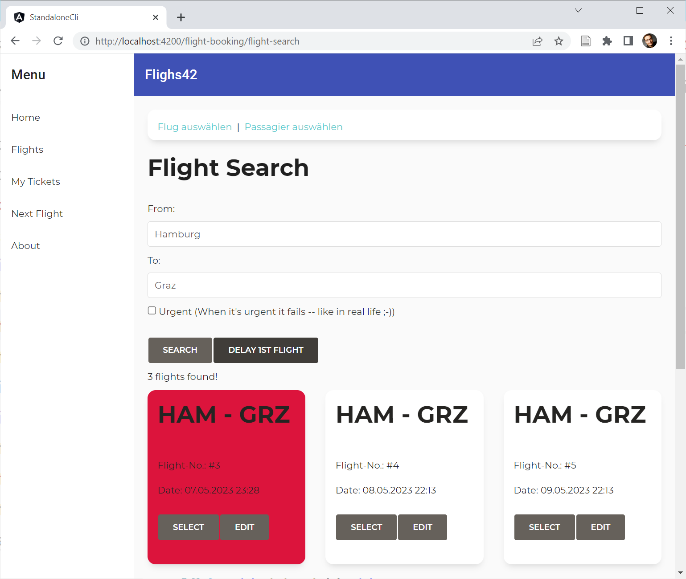

# Experiment 4: Store with Explicit Signals and Ideas from SolidJS

## Experiments

- [Experiment 1: Hidden Signals and Mutables](https://github.com/manfredsteyer/standalone-example-cli/tree/nest)
- [Experiment 2: Explicit Signals and Mutables](https://github.com/manfredsteyer/standalone-example-cli/tree/nest)
- [Experiment 3: Nested Angular Signals with the SolidJS Store](https://github.com/manfredsteyer/standalone-example-cli/tree/solid)
- Experiment 4: Store with Explicit Signals and ideas from SolidJS (this here)

## What's This Experiment About?

✅ Providing a store following ideas from SolidJS

✅ However, as usual in Angular, the Signals are made **explicit** (no proxies!)

✅ The store uses nested Signals for a fine-grained reactivity

✅ The nested Signals are created on demand

✅ The read data is read/only, preventing readers from corrupting the state

✅ However, there is also a method selectWritable allowing the consumer to get a part of the store as a writable Signal. This helps to do 2way-data-binding with local state. Application state should be exposed as read-only Signals.


**Creating the Store**

Typically, the store is owned (encapsulated) by a service assuring that the state is written in a well-defined way or by a component.

```typescript
store = createStore({
    criteria: {
        from: 'Hamburg',
        to: 'Graz',
        urgent: false,
    },
    flights: [] as Flight[],
    basket: {
        3: true,
        5: true,
    } as Record<number, boolean>,
});
```

**Selecting Values**

```typescript
  // Selecting values
  flights = this.store.select((s) => s.flights);
  criteria = this.store.select((s) => s.criteria);

  // Alternative, type-safe syntax:
  basket = this.store.select('basket');

  // Computed Property
  flightRoute = this.store.compute(s => s.criteria().from() + ' to ' + s.criteria().to());

  // Writable Signal for Local State (2-way data binding)
  flightsWritable = this.store.selectWritable(s => s.flights);
```

**Updating the Store**

```typescript
this.store.update((s) => s.flights, flights);

// Alternative (the string is type safe, btw):
this.store.update('flights', flights);
```

## Flattening

```typescript
// Example for flattening (removing all nested signals):
const flat = flatten(this.flights);
console.log('flat flights', flat);
```

## Source

- [Store](src/app/store.ts)
- [Component using the store](src/app/booking/flight-search/flight-search.component.ts)

## How to try it out?

The application uses a trick to visualize the change detection. Each updated flight blinks red:



1. Start the Angular app
2. Click the ``flights`` menu item on the left 
3. Search for flights
4. All flights blink because they need to be data bound
5. Click "Delay 1st flight"
6. Only the 1st flight blinks


## Credits

✅ My GDE fellow [Chau Tran](https://twitter.com/Nartc1410) first came up with a store implementation that created signals on demand.  

✅ My colleagues [Michael Egger-Zikes](https://twitter.com/MikeZks) and [Rainer Hahnekamp](https://twitter.com/rainerhahnekamp) for several good discussions and valuable critical feedback.

✅ Thanks to [Ryan Carniato](https://twitter.com/RyanCarniato), who is not only a great community member but also the principal author of SolidJS and mastermind for Signals.

## Open Questions

✅ We need to check for edge cases 
