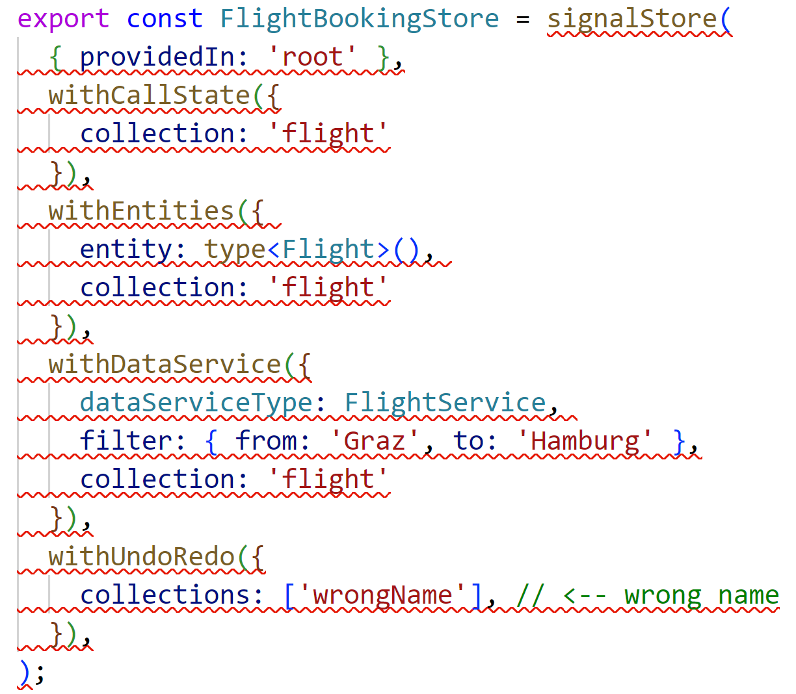

# Example: Dynamic Custom Features for NGRX Signal Store

🔀 **Branch:** ``arc-signal-store-custom-examples-typed``

This example provides some custom features for the NGRX Signal Store. They allow to:

- Track a ``callState`` (``init``, ``loading``, ``loaded``, ``error``) for **several** entities.
- Connect filters and Data Services to the store for **several** entities.
- Manage a list of selected items for **several** entities.
- Configure undo/redo for all the managed filters, entities, and selected entities.
- Configure **names of state slices** to use without compromising **type safety** to avoid naming conflicts when managing several entities.

## Creating a Store with Configured State Slices

```typescript
export const FlightBookingStore = signalStore(
  { providedIn: 'root' },
  withCallState({
    collection: 'flight'
  }),
  withEntities({ 
    entity: type<Flight>(), 
    collection: 'flight'
  }),
  withDataService({
    dataServiceType: FlightService, 
    filter: { from: 'Graz', to: 'Hamburg' },
    collection: 'flight'
  }),
  withUndoRedo({
    collections: ['flight'],
  }),
);
```

This creates a store with several properties including the collection name ``flight``. Although this name is configured, Type Script will take care of a type-safe usage:

```typescript
@Component( [...] )
export class FlightSearchComponent {
  private store = inject(FlightBookingStore);

  from = this.store.flightFilter.from;
  to = this.store.flightFilter.to;
  flights = this.store.flightEntities;
  selected = this.store.selectedFlightEntities;
  selectedIds = this.store.selectedFlightIds;

  loading = this.store.flightLoading;

  canUndo = this.store.canUndo;
  canRedo = this.store.canRedo;

  async search() {
    this.store.loadFlightEntities();
  }

  undo(): void {
    this.store.undo();
  }

  redo(): void {
    this.store.redo();
  }

  updateCriteria(from: string, to: string): void {
    this.store.updateFlightFilter({ from, to });
  }

  updateBasket(id: number, selected: boolean): void {
    this.store.updateSelectedFlightEntities(id, selected);
  }

}
```

## Type Safe Inter-Dependencies

The type system ensures that dependent features, such as ``withEntities`` -- are set up with corresponding collection names. In the following example, ``withUndoRedo`` uses a collection name for which no entity management was set up for:




## Managing Several Entities

You can also set up one store managing several entities. By providing collection names, naming conflicts are avoided:

```typescript
export const FlightBookingStore = signalStore(
  { providedIn: 'root' },
  withCallState({
    collection: 'flight'
  }),
  withEntities({ 
    entity: type<Flight>(), 
    collection: 'flight'
  }),
  withDataService({
    dataServiceType: FlightService, 
    filter: { from: 'Graz', to: 'Hamburg' },
    collection: 'flight'
  }),

  withCallState({
    collection: 'passenger'
  }),
  withEntities({ 
    entity: type<Passenger>(), 
    collection: 'passenger'
  }),
  withDataService({
    dataServiceType: PassengerService, 
    filter: { firstName: 'John', lastName: 'Doe' },
    collection: 'passenger'
  }),

  // Overreaching undo/redo
  withUndoRedo({
    collections: ['flight', 'passenger'],
  }),
);
```

Of course, it's always possible to define one Signal Stores per entity. 

## Usage Without Configured Property Names

You don't need to configure collection names:

```typescript
export const SimpleFlightBookingStore = signalStore(
  { providedIn: 'root' },
  withCallState(),
  withEntities<Flight>(),
  withDataService({
    dataServiceType: FlightService, 
    filter: { from: 'Graz', to: 'Hamburg' },
  }),
  withUndoRedo(),
);
```

In this case you get some default property names:

```typescript
@Component( [...] )
export class FlightSearchSimpleComponent {
  private store = inject(SimpleFlightBookingStore);

  from = this.store.filter.from;
  to = this.store.filter.to;
  flights = this.store.entities;
  selected = this.store.selectedEntities;
  selectedIds = this.store.selectedIds;

  loading = this.store.loading;

  canUndo = this.store.canUndo;
  canRedo = this.store.canRedo;

  async search() {
    this.store.load();
  }

  undo(): void {
    this.store.undo();
  }

  redo(): void {
    this.store.redo();
  }

  updateCriteria(from: string, to: string): void {
    this.store.updateFilter({ from, to });
  }

  updateBasket(id: number, selected: boolean): void {
    this.store.updateSelected(id, selected);
  }

}
```

## More on This

My article series on the NGRX Signal Store discusses the possibilities of implementing custom features:

- [Simplifying your Application With NGRX Signal Store and Custom Features](https://www.angulararchitects.io/en/blog/smarter-not-harder-simplifying-your-application-with-ngrx-signal-store-and-custom-features/)
- [Deep Dive: Flexible and Type-Safe Custom Extensions](https://www.angulararchitects.io/en/blog/ngrx-signal-store-deep-dive-flexible-and-type-safe-custom-extensions/)